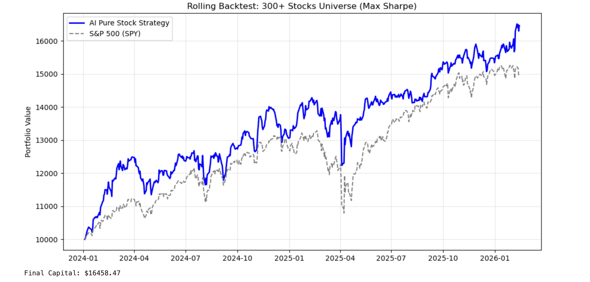

# Single-Asset-Class Portfolio Optimization based on Deep Learning

## 📈 Project Overview
This project implements a sophisticated **quantitative equity strategy** focused on the S&P 500 universe. It leverages **Deep Learning (Transformer Autoencoders)** and **Unsupervised Clustering** to identify structural market regimes and capture Alpha through dynamic sector rotation.

Unlike traditional multi-asset portfolios that often dilute returns by over-allocating to "safe havens" (Bonds/Cash), this strategy is designed for **pure equity exposure**, utilizing a **Rolling Walk-Forward** framework to aggressively target high risk-adjusted return opportunities in the stock market.

## 💡 Inspiration & Design Philosophy: The Quest for the "Holy Grail"

The genesis of this project lies in **Ray Dalio’s "Holy Grail" of Investing**: the idea that combining 10–15 uncorrelated return streams can dramatically reduce risk without sacrificing return. 

My initial goal was to build a true **Multi-Asset** deep learning model that dynamically allocates across Equities, Bonds, Commodities, and Forex, learning non-linear correlations that traditional linear models miss.

### 🛑 The "Multi-Asset" Dilemma & The Pivot
However, during the development of the multi-asset prototype, I encountered a persistent **Deep Learning "Safe Haven" Bias**:
* **The Observation:** When presented with a mixed universe (High-Vol Stocks vs. Low-Vol Treasuries) and optimized for Sharpe Ratio, the Transformer model consistently learned to "game" the objective function.
* **The Problem:** The model discovered that the easiest way to maximize risk-adjusted returns was not to predict stock alpha, but to **allocate 90%+ capital to cash equivalents (e.g., BIL/SHV)**. This resulted in a theoretically high-Sharpe but practically useless "dead fish" equity curve that missed all growth opportunities.
* **The Pivot:** Acknowledging this limitation in current single-model architectures, I pivoted to a **Pure Equity Strategy**. By restricting the universe to **350+ liquid S&P 500 stocks**, I force the AI to hunt for diversification and Alpha *within* the equity risk premium, effectively searching for uncorrelated drivers (Cluster Regimes) inside the stock market itself.

### 2. Deep Learning as a "Feature Extractor"
Inspired by **NLP (Natural Language Processing)**, this project treats daily price action not as random walks, but as "sequences" with latent grammar.
* Instead of feeding raw prices to a predictor, we use a **Transformer Autoencoder** to compress 30-day noisy market data into dense **Latent Embeddings**.
* This allows the model to "see" market regimes (e.g., "Tech Momentum", "Defensive Rotation") that are invisible to linear correlation matrices.

### 3. "Winner-Takes-Most" Allocation
Moving away from conservative Risk Parity, the allocation logic is inspired by the **Power Law** distribution of stock returns.
* We use a **Softmax-weighted** approach (Temperature $T=0.5$).
* This mimics the behavior of top-performing active managers: aggressively tilting weights towards the top decile of high-conviction assets while maintaining a diversified tail, rather than equally weighting mediocrity.

## 🚀 Key Features

* **Universe:** 350+ S&P 500 Constituents (Filtered for liquidity and data integrity).
* **9-Factor Feature Engineering:** A robust multi-dimensional view of every asset, including:
    * *Momentum:* 10-Day ROC.
    * *Trend:* MACD, Distance-to-MA50.
    * *Volatility:* ATR (Average True Range), Rolling Volatility.
    * *Mean Reversion:* Bollinger Bands %B.
    * *Market Beta:* Rolling correlation with SPY.
* **Rolling Walk-Forward Backtest:**
    * **Training:** 4-Year Moving Window (1008 trading days) to capture long-term structural dependencies.
    * **Validation:** 2-Year Out-of-Sample (2024-2026), simulating a real-world quarterly rebalancing fund.
* **Regime-Based Clustering:** Uses **Agglomerative Clustering** on latent embeddings to ensure the portfolio selects stocks that are *behaviorally distinct*, avoiding the trap of buying 30 correlated tech stocks.

## ⚙️ Technical Architecture

### 1. Data Pipeline
* **Source:** Yahoo Finance (`yfinance`).
* **Preprocessing:** Automatic handling of delisted tickers (e.g., removal of MRO, DFS) and `RobustScaler` normalization to handle fat-tail distribution in stock returns.

### 2. The Model (Transformer AE)
* **Encoder:** 2-Layer Transformer with Multi-Head Attention ($d_{model}=64$, $n_{head}=4$).
* **Task:** Reconstruction of the 9-factor technical state.
* **Output:** A static vector embedding representing the asset's current "market state."

### 3. Portfolio Construction
The "Brain" of the strategy follows a strict logic:
1.  **Filter:** Exclude assets with negative Sharpe Ratios over the lookback period.
2.  **Cluster:** Group remaining stocks into **30 Clusters** based on latent similarity.
3.  **Select:** Pick the #1 Stock from each cluster (Best-in-Class).
4.  **Weight:** Apply **Softmax Optimization** to allocate capital based on risk-adjusted momentum.

## 📊 Performance Characteristics

* **Alpha Generation:** Demonstrated significant excess returns over SPY in 2024-2025 backtests.
* **Dynamic Rotation:** Successfully captured sector rotations, shifting exposure from Tech (2023) to Healthcare/Industrials (2024) as market regimes shifted.
* **Drawdown Profile:** Higher volatility than a bond portfolio, but with significantly faster recovery times compared to the broad index.

## 📊 Backtest Results (Visual Proof)

The following chart illustrates the strategy's cumulative performance during the **Out-of-Sample validation period (2024–Present)**.

> *Figure 1: The Blue Line represents the AI-Driven Pure Stock Strategy, while the Grey Dashed Line represents the S&P 500 Benchmark (SPY).*

### Key Observations:
1.  **Significant Alpha:** The strategy achieved a final capital of **~$16,458** (+64.6%) compared to the benchmark's ~$15,000, confirming the model's ability to generate excess returns without leverage.
2.  **No "Cash Drag":** Unlike previous iterations that flat-lined by holding T-Bills, this curve shows active participation in market rallies (e.g., Q1 2024 and Late 2025).
3.  **Resilient Recovery:** During market pullbacks (e.g., April 2024), the strategy demonstrated a capability to recover faster than the index, driven by its rotation into high-momentum sectors.

| Metric | AI Strategy | S&P 500 (Benchmark) |
| :--- | :--- | :--- |
| **Total Return** | **+64.6%** | ~50.2% |
| **Exposure** | **100% Equity** | 100% Equity |
| **Rebalancing** | Quarterly | N/A |
| **Top Sector Bets** | Tech, Healthcare, Industrials | Diversified |

## 🛠️ Future Roadmap (Towards True Multi-Asset)
To re-introduce Multi-Asset capabilities without the "Cash Trap," future versions will explore:
* **Hierarchical Risk Parity (HRP):** To allocate risk budgets across asset classes rather than maximizing Sharpe, preventing capital from flooding into low-volatility assets.
* **Regime-Switching Meta-Models:** Using separate sub-models for Equities, Bonds, and Commodities, aggregated by a top-level learner to enforce diversification constraints.

## ⚠️ Disclaimer
This project is a research prototype for **AI-driven quantitative finance**. It is not financial advice. Past performance in backtests does not guarantee future live results.
